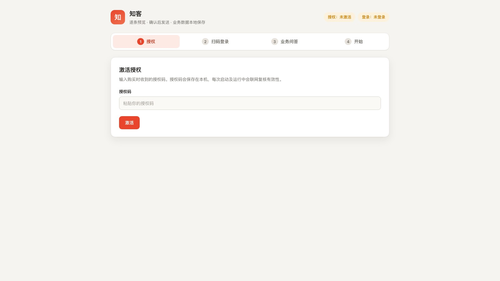

# 知客

[English](README.md) | [简体中文](README.zh-CN.md)

知客是抖音评论区的自动接待员，支持 macOS Apple Silicon 与 Windows x64。它自动巡查你账号下的作品评论，按你配置的业务话术自动匹配、自动回复——在你设定的活跃时段内持续值守，护栏内建，数据全在本机。



## 它能做什么

- **自动巡查**：按计划扫描你的全部作品，自动发现未回复的公开评论；有评论的作品优先，新发作品兜底，不漏老视频。
- **自动匹配话术**：本地业务问答库（账号话术 + 作品问答 + FAQ）即时生成回复；价格、购买方式、合作等关键问题按你写好的固定答案回，不跑偏。
- **全自动执行**：开启「每小时自动巡查」后，软件在活跃时段内每小时自动匹配并发送，无需逐批确认；也可点「立即自动跑一次」。
- **护栏内建**：每日上限硬封顶、发送账本去重（同一条评论绝不重复回）、北京时间活跃时段、发送结果三态（已确认 / 未知 / 失败），未知状态不盲目重试。
- **多账号隔离**：登录态、话术、配额、发送账本按账号各管各的。
- **数据留在本机**：支持一键导出、恢复、清除；不上传你的业务数据。

私信接待在产品路线图上，后续版本推进。

## 当前正式版

版本：`v2.1.7`　平台：macOS Apple Silicon、Windows x64

安装包公开下载，核心业务功能使用在线卡密激活。核心 Python 模块采用 PyArmor Basic 混淆以提高逆向成本，但不承诺“无法破解”。

### macOS Apple Silicon

- [从知客官网下载 v2.1.7](https://zhike.crewup.cn/dl/macos/2.1.7/%E7%9F%A5%E5%AE%A2-v2.1.7-macos-arm64.zip)
- [查看 GitHub Release](https://github.com/JefferyMaa/kenton-zhike/releases/tag/v2.1.7)
- [查看 SHA-256 校验文件](https://zhike.crewup.cn/dl/macos/2.1.7/%E7%9F%A5%E5%AE%A2-v2.1.7-macos-arm64.zip.sha256)

```text
b238b2608b2a8fd0065b3d1fdfae930b1d3616add2be8a438db0477bb5629d33
```

### Windows x64

- [从知客官网下载 v2.1.7](https://zhike.crewup.cn/dl/windows/2.1.7/%E7%9F%A5%E5%AE%A2-v2.1.7-windows-x64.zip)
- [查看 GitHub Release](https://github.com/JefferyMaa/kenton-zhike/releases/tag/v2.1.7)
- [查看 SHA-256 校验文件](https://zhike.crewup.cn/dl/windows/2.1.7/%E7%9F%A5%E5%AE%A2-v2.1.7-windows-x64.zip.sha256)

```text
e8c852d8f380dc81d21d62ddd91dfff9ea3b1efdc6f70997ad0f0fb731575557
```

## 5 分钟上手

1. 下载 ZIP，核对 SHA-256。
2. 解压运行启动器：macOS 首次右键 `启动.command` 选「打开」，若仍被拦，到「系统设置 → 隐私与安全性」点「仍要打开」；Windows 双击 `启动.bat`，普通 SmartScreen 提示可选「更多信息 → 仍要运行」。如果 Windows 11 的 Smart App Control 直接阻止，当前未签名版不兼容，请勿为知客关闭系统安全功能。
3. 等首次环境准备完成（自动安装哈希锁定的依赖和 Chromium，之后启动秒开）。
4. 在本地页面输入卡密激活。
5. 扫码登录抖音，填好业务话术。
6. 点「立即自动跑一次」马上匹配并发送，或开启「每小时自动巡查」持续值守；无需逐批确认。

完整步骤见[首次使用指南](docs/quickstart.md)。

## 卡密与联网边界

下载软件不等于获得使用授权。未激活时只开放启动诊断、授权激活/状态和本机数据导出清除，其余业务 API 默认拒绝。授权码、产品标识和设备标识会在激活、启动及运行中定期发送到知客授权服务器，用于设备绑定、到期与吊销判断；运行中最长约 1 小时刷新一次状态。

## 数据与隐私

平台登录态、业务话术、评论处理记录和发送账本默认保存在你自己的电脑上，不发送给知客授权服务器，也不发给外部大模型。软件联网只访问三处：抖音（你发起的登录与评论操作）、依赖与 Chromium 下载源（首次安装）、知客授权服务（卡密验证）。公开评论可能涉及第三方个人信息，请按适用法律法规使用。

## 边界

- 知客是第三方独立工具，与抖音（字节跳动）官方无关联；自动化操作存在平台规则与账号风险，请自行评估。
- 关键词匹配可能误命中，请只配置准确、仍然有效的话术，并定期检查评论区和发送账本。
- 抖音页面或接口改版可能影响功能，我们随版本跟进。
- macOS 侧未做 Apple 公证，Windows 侧未做代码签名（SmartScreen 可能提示，Smart App Control 可能直接阻止）；请勿为了运行知客关闭系统安全功能。两端核心 Python 模块均采用 PyArmor Basic 混淆，只提高逆向成本，不代表无法破解。

## 文档

- [首次使用指南](docs/quickstart.md)
- [故障排查](docs/troubleshooting.md)
- [安全政策](SECURITY.md)
- [v2.1.7 发布说明](docs/releases/v2.1.7.md)
- [知客官网](https://zhike.crewup.cn/)

## 获取卡密与支持

购买卡密走[知客官网](https://zhike.crewup.cn/#buy)公布的联系方式。使用问题可提 GitHub Issue，请勿上传卡密、Cookie、登录态目录或完整日志。

## 许可

本仓库公开发行说明与用户文档，软件本身不以开源许可证授权。软件、文档和发行包的使用受 [LICENSE](LICENSE) 及安装包内《软件授权与服务条款》约束；第三方组件适用各自许可证。

<!-- name: 知客 | origin: Kenton | type: public-distribution | status: active -->
